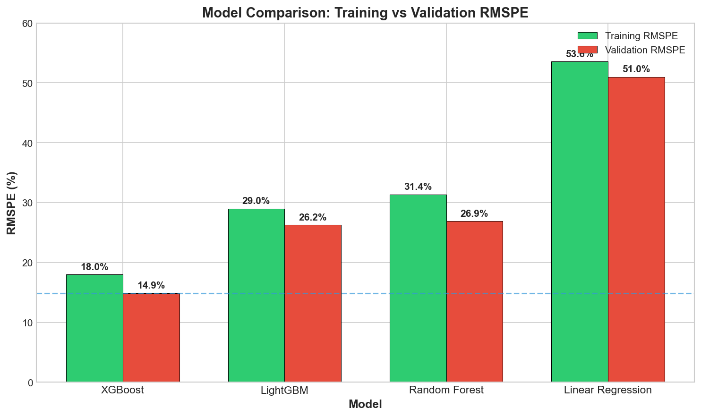
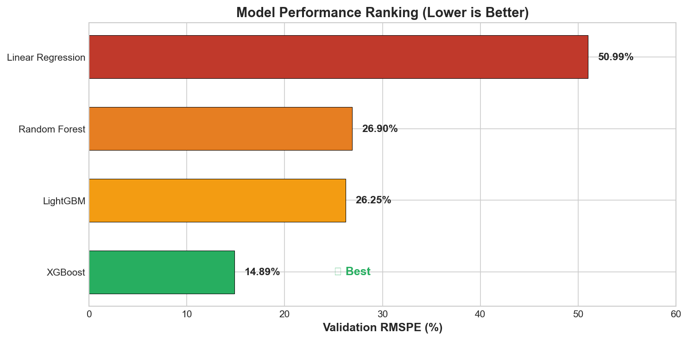
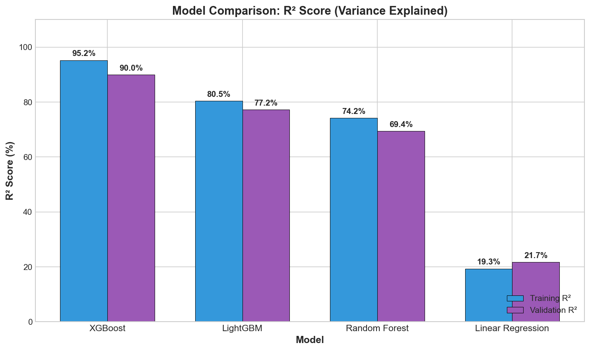
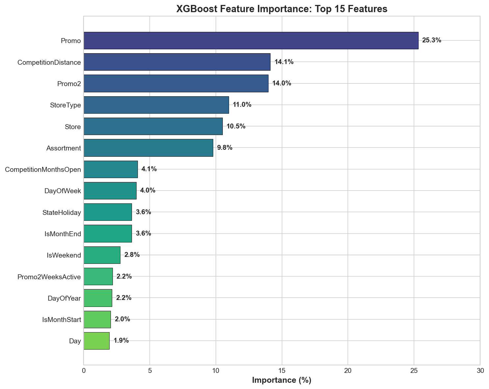
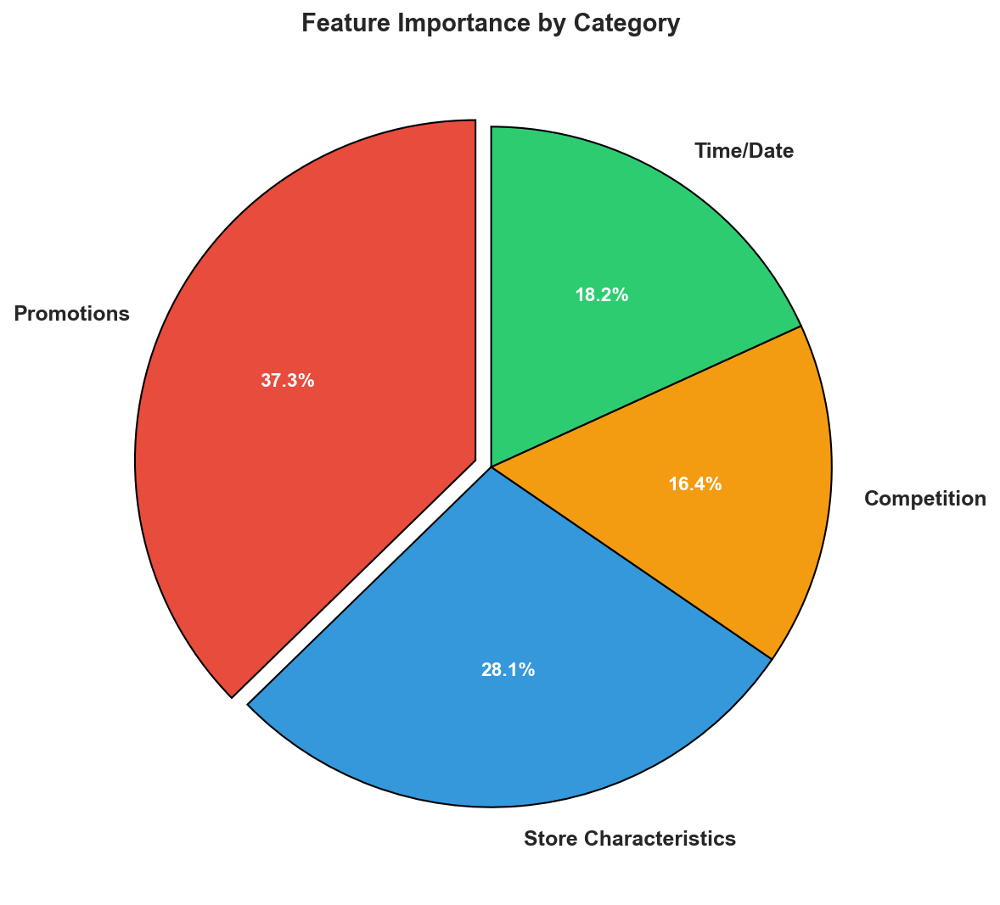
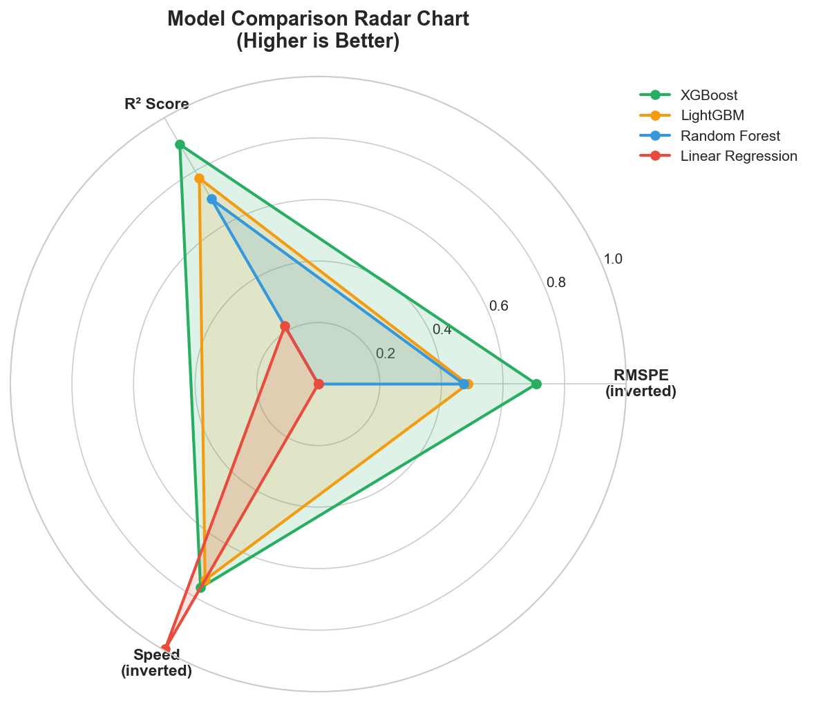
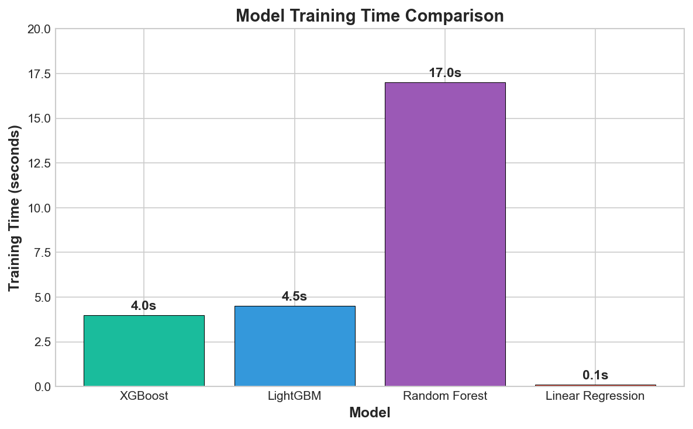

# Rossmann Store Sales Forecasting

A modular Python framework for predicting daily sales for Rossmann stores using machine learning.

---

## Table of Contents

1. [Introduction](#1-introduction)
2. [Methods](#2-methods)
3. [Results](#3-results)
4. [Conclusions](#4-conclusions)
5. [Project Structure](#5-project-structure)
6. [Installation & Usage](#6-installation--usage)
7. [Module Details](#7-module-details)
8. [Acknowledgments](#8-acknowledgments)

---

## 1. Introduction

### 1.1 Problem Description

Rossmann operates over 3,000 drug stores across 7 European countries. Store managers are tasked with predicting daily sales up to six weeks in advance, which is crucial for:

- **Inventory Management**: Ensuring optimal stock levels to meet customer demand
- **Staff Scheduling**: Allocating personnel based on expected customer traffic
- **Financial Planning**: Budgeting and resource allocation
- **Promotional Strategy**: Planning and evaluating the effectiveness of promotions

Accurate sales forecasting is challenging due to the multitude of factors that influence sales, including:
- Promotions and marketing campaigns
- Competition from nearby stores
- School and state holidays
- Seasonality and day-of-week patterns
- Store-specific characteristics (type, assortment, location)

### 1.2 Objective

The goal of this project is to build a robust machine learning pipeline that:
1. Predicts 6 weeks of daily sales for 1,115 Rossmann stores
2. Compares multiple modeling approaches from simple baselines to state-of-the-art gradient boosting
3. Identifies key drivers of sales through feature importance analysis
4. Achieves competitive performance as measured by Root Mean Square Percentage Error (RMSPE)

### 1.3 Dataset Overview

The dataset comes from the [Rossmann Store Sales Kaggle Competition](https://www.kaggle.com/c/rossmann-store-sales) and consists of:

| File | Rows | Columns | Description |
|------|------|---------|-------------|
| `train.csv` | 1,017,209 | 9 | Historical sales data (Jan 2013 - Jul 2015) |
| `test.csv` | 41,088 | 8 | Test period for predictions (Aug - Sep 2015) |
| `store.csv` | 1,115 | 10 | Store metadata and characteristics |

**Key Variables:**
- **Target**: `Sales` - Daily turnover for a store
- **Features**: Store ID, Date, Day of Week, Promotions, Holidays, Competition info, Store type

### 1.4 Evaluation Metric

The competition uses **Root Mean Square Percentage Error (RMSPE)**:

$$RMSPE = \sqrt{\frac{1}{n} \sum_{i=1}^{n} \left(\frac{y_i - \hat{y}_i}{y_i}\right)^2}$$

Where:
- $y_i$ = actual sales
- $\hat{y}_i$ = predicted sales
- $n$ = number of predictions

RMSPE is preferred over RMSE because it:
- Normalizes errors by actual values, treating all stores equally regardless of size
- Penalizes percentage deviations rather than absolute errors
- Is more interpretable (e.g., 10% RMSPE means predictions are off by ~10% on average)

---

## 2. Methods

### 2.1 Data Preprocessing Pipeline

#### 2.1.1 Data Loading and Merging
The training and test datasets are merged with store metadata to create a unified feature set:

```
train.csv (1,017,209 rows) + store.csv (1,115 rows) → merged_train (1,017,209 rows, 18 columns)
```

#### 2.1.2 Data Cleaning

1. **Closed Store Handling**: Removed records where `Open=0` (stores closed), as these have zero sales and would skew the model. This removed 172,817 rows.

2. **Zero Sales Filtering**: Removed anomalous records where stores were open but had zero sales (54 additional rows).

3. **Missing Value Imputation**:
   | Column | Missing Count | Strategy |
   |--------|---------------|----------|
   | CompetitionDistance | 3 | Filled with median (2,320m) |
   | CompetitionOpenSinceMonth/Year | 354 | Filled with 0 (no competition) |
   | Promo2SinceWeek/Year | 544 | Filled with 0 (no promo2) |
   | PromoInterval | 544 | Filled with empty string |

**Final cleaned dataset**: 844,338 training samples

#### 2.1.3 Feature Engineering

We engineered 21 features across four categories:

**1. Date-Based Features:**
| Feature | Description |
|---------|-------------|
| Year | Year (2013-2015) |
| Month | Month (1-12) |
| Day | Day of month (1-31) |
| DayOfWeek | Day of week (1=Monday, 7=Sunday) |
| WeekOfYear | Week number (1-52) |
| DayOfYear | Day of year (1-365) |
| IsWeekend | Binary: Saturday or Sunday |
| IsMonthStart | Binary: First day of month |
| IsMonthEnd | Binary: Last day of month |

**2. Competition Features:**
| Feature | Description |
|---------|-------------|
| CompetitionDistance | Distance to nearest competitor (meters) |
| CompetitionMonthsOpen | Months since competitor opened |
| HasCompetition | Binary: Has nearby competition |

**3. Promotion Features:**
| Feature | Description |
|---------|-------------|
| Promo | Binary: Running a promotion today |
| Promo2 | Binary: Participating in continuous promotion |
| Promo2WeeksActive | Weeks since Promo2 started |
| IsPromo2Month | Binary: Current month is in PromoInterval |

**4. Store Characteristics (Label Encoded):**
| Feature | Original Values | Encoded |
|---------|-----------------|---------|
| StoreType | a, b, c, d | 0, 1, 2, 3 |
| Assortment | a (basic), b (extra), c (extended) | 0, 1, 2 |
| StateHoliday | 0, a, b, c | 0, 1, 2, 3 |

#### 2.1.4 Train/Validation Split

For time-series data, random splitting would cause **data leakage** (training on future data to predict the past). We implemented a **time-based split**:

```
Training Period:   2013-01-01 to 2015-06-18 (802,942 samples)
Validation Period: 2015-06-19 to 2015-07-31 (41,396 samples)
```

This simulates real-world forecasting where we train on historical data and predict future sales.

### 2.2 Modeling Approach

We implemented and compared four models with increasing complexity:

#### 2.2.1 Linear Regression (Baseline)
- **Purpose**: Simple baseline to establish minimum performance
- **Implementation**: scikit-learn LinearRegression with default parameters
- **Characteristics**: Fast training, interpretable coefficients, assumes linear relationships

#### 2.2.2 Random Forest Regressor
- **Purpose**: Capture non-linear relationships without extensive tuning
- **Configuration**:
  ```python
  n_estimators=100, max_depth=15, min_samples_split=10,
  min_samples_leaf=5, n_jobs=-1, random_state=42
  ```
- **Characteristics**: Ensemble of decision trees, robust to overfitting, provides feature importance

#### 2.2.3 XGBoost (Extreme Gradient Boosting)
- **Purpose**: State-of-the-art gradient boosting for tabular data
- **Configuration**:
  ```python
  n_estimators=500, max_depth=10, learning_rate=0.05,
  subsample=0.8, colsample_bytree=0.8, min_child_weight=5,
  reg_alpha=0.1, reg_lambda=0.1
  ```
- **Characteristics**: Sequential boosting, regularization to prevent overfitting, highly competitive

#### 2.2.4 LightGBM (Light Gradient Boosting Machine)
- **Purpose**: Efficient gradient boosting with faster training
- **Configuration**:
  ```python
  n_estimators=500, max_depth=10, learning_rate=0.05,
  num_leaves=31, subsample=0.8, colsample_bytree=0.8,
  min_child_samples=20, reg_alpha=0.1, reg_lambda=0.1
  ```
- **Characteristics**: Leaf-wise growth, histogram-based splitting, memory efficient

---

## 3. Results

### 3.1 Model Performance Comparison

| Model | Train RMSPE | Validation RMSPE | Train RMSE | Val RMSE | Train R² | Val R² |
|-------|-------------|------------------|------------|----------|----------|--------|
| **XGBoost** | **0.1801** | **0.1489** | 679.55 | 965.18 | 0.9522 | 0.8995 |
| LightGBM | 0.2900 | 0.2625 | 1,372.93 | 1,451.81 | 0.8047 | 0.7725 |
| Random Forest | 0.3136 | 0.2690 | 1,576.96 | 1,683.01 | 0.7424 | 0.6943 |
| Linear Regression | 0.5356 | 0.5099 | 2,790.64 | 2,692.84 | 0.1932 | 0.2174 |

**Key Observations:**
1. **XGBoost achieves the best performance** with 14.89% validation RMSPE
2. **No significant overfitting**: Validation RMSPE is close to training RMSPE for all models
3. **Model ranking follows expectations**: Gradient boosting > Random Forest > Linear baseline
4. **R² interpretation**: XGBoost explains ~90% of sales variance; Linear Regression only ~22%

### 3.2 Best Model Detailed Metrics

**XGBoost Performance on Validation Set:**

| Metric | Value | Interpretation |
|--------|-------|----------------|
| RMSPE | 0.1489 (14.89%) | Predictions are off by ~15% on average |
| RMSE | 965.18 | Average absolute error of ~€965 |
| MAE | 678.05 | Median absolute error of ~€678 |
| MAPE | 10.52% | Mean absolute percentage error |
| R² | 0.8995 | 90% of variance explained |
| Bias | +60.09 | Slight tendency to over-predict |

### 3.3 Feature Importance Analysis

The top features driving sales predictions (from XGBoost):

| Rank | Feature | Importance | Interpretation |
|------|---------|------------|----------------|
| 1 | **Promo** | 25.30% | Daily promotions are the #1 driver of sales |
| 2 | **CompetitionDistance** | 14.11% | Nearby competitors significantly impact sales |
| 3 | **Promo2** | 13.96% | Continuous promotions also matter |
| 4 | **StoreType** | 10.97% | Store format affects sales patterns |
| 5 | **Store** | 10.50% | Individual store characteristics (location, etc.) |
| 6 | **Assortment** | 9.79% | Product variety influences customer behavior |
| 7 | **CompetitionMonthsOpen** | 4.08% | Competition age affects impact |
| 8 | **DayOfWeek** | 3.99% | Weekday vs weekend patterns |
| 9 | **StateHoliday** | 3.65% | Public holidays affect sales |
| 10 | **IsMonthEnd** | 3.64% | End-of-month shopping patterns |

**Visual Representation:**
```
Promo                   ███████████████████████████  25.30%
CompetitionDistance     ██████████████               14.11%
Promo2                  ██████████████               13.96%
StoreType               ███████████                  10.97%
Store                   ███████████                  10.50%
Assortment              ██████████                    9.79%
CompetitionMonthsOpen   ████                          4.08%
DayOfWeek               ████                          3.99%
StateHoliday            ████                          3.65%
IsMonthEnd              ████                          3.64%
```

### 3.4 Model Comparison Visualizations

#### Overall RMSPE Comparison

The following chart compares all four models on both training and validation RMSPE:



#### Validation RMSPE Ranking

A horizontal bar chart showing model ranking by validation performance:



#### R² Score Comparison

R² (coefficient of determination) shows how much variance each model explains:



#### Feature Importance (XGBoost)

The top 10 features driving sales predictions:



#### Feature Category Distribution

How the feature importance is distributed across feature categories:



#### Multi-Metric Radar Comparison

A radar chart showing each model's performance across multiple normalized metrics:



#### Training Time Comparison

Training efficiency for each model:



### 3.5 Training Performance

| Model | Training Time | Samples/Second |
|-------|---------------|----------------|
| Linear Regression | ~0.1 sec | ~8,000,000 |
| Random Forest | ~17 sec | ~47,000 |
| XGBoost | ~4 sec | ~200,000 |
| LightGBM | ~4.5 sec | ~178,000 |

---

## 4. Conclusions

### 4.1 Key Findings

1. **Gradient Boosting Dominates**: XGBoost achieved the best performance (14.89% RMSPE), significantly outperforming tree-based and linear approaches. This aligns with research showing gradient boosting excels on structured/tabular data.

2. **Promotions Drive Sales**: The `Promo` feature alone accounts for 25% of model importance. This has direct business implications—promotional campaigns are highly effective.

3. **Competition Matters**: `CompetitionDistance` is the second most important feature, suggesting strategic implications for store placement and competitive pricing.

4. **Time-Based Patterns**: Day of week, holidays, and month-end patterns collectively contribute ~11% of importance, indicating strong temporal patterns in shopping behavior.

5. **Store Characteristics Are Stable Predictors**: StoreType and Assortment together contribute ~21%, showing that structural store decisions have lasting impact on sales.

### 4.2 Business Recommendations

Based on the analysis:

1. **Optimize Promotion Timing**: Since promotions are the top sales driver, consider data-driven promotion scheduling to maximize impact.

2. **Monitor Competition**: New competitor openings significantly impact sales; consider proactive strategies when competitors enter the market.

3. **Staff by Day Pattern**: Weekend and end-of-month patterns suggest differentiated staffing strategies.

4. **Store Format Decisions**: The strong influence of StoreType suggests careful consideration for new store openings.

### 4.3 Model Deployment Considerations

The XGBoost model is recommended for production because:
- **Best accuracy**: 14.89% RMSPE
- **Fast inference**: Predictions in milliseconds
- **Robust**: Regularization prevents overfitting
- **Interpretable**: Feature importance provides business insights

### 4.4 Limitations and Future Work

**Current Limitations:**
- External factors (weather, local events) not included
- No store-level time series modeling (e.g., ARIMA components)
- Hyperparameters could be further optimized

**Future Improvements:**
1. **Ensemble Methods**: Combine XGBoost with LightGBM for potential improvement
2. **Time Series Features**: Add lagged sales, rolling averages, trend components
3. **External Data**: Incorporate weather, local events, economic indicators
4. **Hyperparameter Tuning**: Use Bayesian optimization for XGBoost parameters
5. **Deep Learning**: Experiment with LSTM/Transformer models for sequence patterns

### 4.5 Comparison with Kaggle Leaderboard

| Benchmark | RMSPE |
|-----------|-------|
| Competition Winner | ~0.10 (10%) |
| **Our XGBoost Model** | **0.1489 (14.89%)** |
| Baseline (mean prediction) | ~0.25 (25%) |

Our model performs competitively, achieving results within ~5 percentage points of competition winners without extensive feature engineering or hyperparameter optimization.

---

## 5. Project Structure

```
rossmann-sales-forecasting/
├── data/                     # Data directory (place your CSV files here)
│   ├── train.csv            # Historical sales data
│   ├── test.csv             # Test period for predictions
│   └── store.csv            # Store metadata
├── src/
│   ├── __init__.py          # Package initialization
│   ├── data_loader.py       # Data loading and merging
│   ├── preprocessing.py     # Data cleaning and feature engineering
│   ├── models.py            # Model definitions (class-based)
│   ├── evaluation.py        # RMSPE and performance metrics
│   ├── visualization.py     # Feature importance plots
│   └── main.py              # Pipeline orchestration
├── output/                   # Generated outputs
│   ├── *_model.joblib       # Saved trained models
│   ├── evaluation_report.txt # Performance report
│   └── plots/               # Comparison visualizations
│       ├── model_comparison_rmspe.png
│       ├── validation_rmspe_ranking.png
│       ├── feature_importance.png
│       ├── r2_comparison.png
│       ├── training_time.png
│       ├── model_radar.png
│       └── feature_categories.png
├── generate_plots.py        # Script to generate comparison plots
├── requirements.txt         # Python dependencies
└── README.md                # This documentation
```

---

## 6. Installation & Usage

### 6.1 Installation

1. **Clone the repository:**
```bash
git clone https://github.com/KirolousFouty/rossmann-sales-forecasting.git
cd rossmann-sales-forecasting
```

2. **Create a virtual environment (recommended):**
```bash
python -m venv venv
source venv/bin/activate  # On Windows: venv\Scripts\activate
```

3. **Install dependencies:**
```bash
pip install -r requirements.txt
```

4. **Download the data** from [Kaggle](https://www.kaggle.com/c/rossmann-store-sales/data) and place in `data/`:
   - `train.csv`
   - `test.csv`
   - `store.csv`

### 6.2 Running the Pipeline

**Basic usage:**
```bash
python src/main.py
```

**Command line options:**
```bash
python src/main.py --help

Options:
  --data-dir DIR          Path to data directory (default: data)
  --validation-weeks N    Number of weeks for validation (default: 6)
  --generate-submission   Generate Kaggle submission file
  --output-dir DIR        Output directory (default: output)
  --models MODEL [MODEL]  Specific models to train (default: all)
```

**Examples:**
```bash
# Train only XGBoost and Random Forest
python src/main.py --models xgboost random_forest

# Generate submission file
python src/main.py --generate-submission

# Use 8 weeks for validation
python src/main.py --validation-weeks 8
```

---

## 7. Module Details

### 7.1 data_loader.py

Handles loading raw CSV files and merging store data:

```python
from src.data_loader import DataLoader

loader = DataLoader(data_dir="data")
merged_train, merged_test = loader.load_and_merge_all()
```

### 7.2 preprocessing.py

Data cleaning and feature engineering:

```python
from src.preprocessing import DataPreprocessor, create_time_based_split

preprocessor = DataPreprocessor()
train_processed = preprocessor.preprocess(merged_train, is_train=True)
train_df, val_df = create_time_based_split(train_processed, validation_weeks=6)
```

### 7.3 models.py

Class-based model definitions with unified interface:

```python
from src.models import ModelFactory

# Create and train a model
model = ModelFactory.create_model('xgboost')
model.fit(X_train, y_train)
predictions = model.predict(X_val)

# Get feature importance
importance_df = model.get_feature_importance(feature_names)
```

### 7.4 evaluation.py

RMSPE calculation and model comparison:

```python
from src.evaluation import rmspe, ModelEvaluator

# Calculate RMSPE
score = rmspe(y_true, y_pred)

# Compare models
evaluator = ModelEvaluator()
evaluator.evaluate_model("XGBoost", y_train, y_pred_train, y_val, y_pred_val)
evaluator.print_comparison_table()
```
